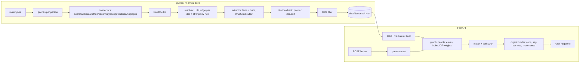

# Arrival Engine — Design

## Architecture

One Python package `arrival/` with two entry points: a CLI (`python -m arrival build`) that runs the research pipeline offline and writes dossier JSON, and a FastAPI app that boots from those JSON files, holds presence in memory, and serves digests. The research pipeline is the slow, LLM-heavy, network-heavy half; the arrival path is graph math over cached data plus one small LLM call.



Package layout (write-ownership boundaries for tickets):

```
src/arrival/
  contracts.py        # ALL shared Pydantic models + Protocols (T-0). Import, never redefine.
  config.py           # Settings from env (T-0)
  util.py             # slug(), normalize_ws(), doc_id(url) — shared primitives, import never reimplement (T-0)
  http/               # client, rate limiter, disk cache, page-text extraction (T-1)
  connectors/         # one module per source, each a Connector (T-1)
  llm/                # AnthropicClient (LLMClient impl) + prompt files (T-2); LLMDouble lives in tests/doubles.py
  resolve.py          # entity resolution (T-2)
  extract.py          # fact/hub extraction + citation check (T-3)
  taste.py            # taste filter (T-4)
  research.py         # pipeline orchestration + build CLI (T-6)
  graph.py            # graph build, scoring, path (T-5)
  digest.py           # digest builder (T-7)
  web/                # FastAPI app, routes, templates (T-8)
  __main__.py         # CLI dispatch (T-0 stub, T-6 fills `build`)
data/roster.yaml      # the ten people (filled); tests use tests/fixtures/roster_synthetic.yaml
data/dossiers/        # committed output of build
data/docs/            # committed RawDocs cited by the dossiers (T-6 writes, T-9 commits)
HOURS.md              # append-only hours log; exempt from ownership checks (T-0 creates, T-9 folds into README)
tests/
  conftest.py         # ticket marker + --ticket selection (T-0)
  doubles.py          # LLMDouble, ConnectorDouble (T-0)
  fixtures/dossiers/  # 4 synthetic, schema-valid dossiers with designed hub overlaps (T-0)
  fixtures/http/      # recorded HTTP responses as RawDoc JSON (T-0 for dossier docs, T-1 per connector)
  fixtures/           # taste_cases.yaml (T-4), resolve_cases/ (T-2), roster_synthetic.yaml (T-6)
```

## Interfaces (contracts between tickets)

Everything below lives in `src/arrival/contracts.py` and is shipped by **T-0**. Tickets import these; they do not redefine or subclass them without a `conforms_to` test. Signatures are the contract; bodies are the ticket's job.

```python
# --- identity -------------------------------------------------------------
class PersonRef(BaseModel):
    person_id: str            # slug(name) [+ "-" + slug(details[0]) on collision]
    name: str
    details: list[str] = []   # e.g. ["CEO of Acme", "Austin"]

# --- retrieval ------------------------------------------------------------
SourceKind = Literal[
    "self_page", "search", "wikidata", "wikipedia", "github", "edgar",
    "uspto", "propublica", "wayback", "hn", "openalex", "youtube", "podcast",
    "fec", "courtlistener",
]
class RawDoc(BaseModel):
    doc_id: str               # sha1(url)[:16]
    source_kind: SourceKind
    url: str
    title: str = ""
    text: str                 # extracted plain text, ≤ 20k chars, never empty
    published_at: date | None = None
    fetched_at: datetime

class Connector(Protocol):
    kind: SourceKind
    async def search(self, person: PersonRef, budget: int) -> list[RawDoc]: ...
    # budget = max docs to return. Must never raise on network/HTTP error: log and return [].

# --- resolution -----------------------------------------------------------
class Verdict(BaseModel):
    doc_id: str
    match: Literal["yes", "no", "unsure"]
    confidence: float         # 0..1
    evidence: str             # verbatim span from doc.text supporting the verdict
    disambiguator: str        # which detail (employer/city/role/handle) decided it

class Resolution(BaseModel):
    person_id: str
    status: Literal["resolved", "unresolved"]
    strong_keys: dict[str, str] = {}   # {"wikidata_qid": "Q..", "github": "..", "company_domain": "..", "sec_cik": ".."}
    accepted_doc_ids: list[str]
    rejected: list[Verdict]            # kept for /debug
    confidence: float                  # 0..1, overall

# --- facts ----------------------------------------------------------------
FactCategory = Literal[
    "current_work", "collaborator", "interest", "recent_activity", "hook",
    "affiliation", "non_obvious",
]
ExclusionReason = Literal[
    "home_or_property", "family", "health", "legal", "wealth", "political", "low_confidence", "source_kind_not_displayable",
]
class Provenance(BaseModel):
    doc_id: str
    url: str
    source_kind: SourceKind
    quote: str                # verbatim; must be substring of RawDoc.text after whitespace-normalisation
    published_at: date | None = None
    retrieved_at: datetime
    confidence: float

class Fact(BaseModel):
    fact_id: str
    text: str                 # ≤ 200 chars, one sentence
    category: FactCategory
    provenance: Provenance
    excluded: bool = False
    exclusion_reason: ExclusionReason | None = None

HubType = Literal["company", "investor", "school", "board", "topic", "city", "technology", "event", "cause", "person"]
class Hub(BaseModel):
    hub_id: str               # canonical: "wd:Q123" if Wikidata-resolved else "{type}:{slug(label)}"
    label: str
    type: HubType
    recency: float = 1.0      # 0..1, 1 = tied to current work, decays with age
    evidence_fact_ids: list[str] = []

class Dossier(BaseModel):
    person: PersonRef
    resolution: Resolution
    facts: list[Fact]         # includes excluded facts (flag set)
    hubs: list[Hub]
    built_at: datetime
    schema_version: int = 1

# --- matching -------------------------------------------------------------
class HubContribution(BaseModel):
    hub: Hub                  # the ARRIVING person's Hub object (its evidence_fact_ids resolve in the arriving dossier)
    idf_weight: float
    recency: float            # min(recency on A's edge, recency on B's edge)
    type_boost: float
    contribution: float       # idf_weight * recency * type_boost

class Match(BaseModel):
    other: PersonRef
    score: float              # 0..100
    contributions: list[HubContribution]   # sorted desc, the exposed reasoning (R10)
    path: list[str]           # ["person:a", "hub:wd:Q1", "person:b"]
    why: str                  # one sentence, names the top shared hub(s)

# --- digest ---------------------------------------------------------------
class Digest(BaseModel):
    digest_id: str
    person: PersonRef
    who_line: str
    meet: list[Match]         # len ≤ 3
    lately: list[Fact]        # len ≤ 3, displayable only
    non_obvious: Fact | None  # exactly 1 when available (R7)
    say_out_loud: str
    sources: list[Provenance] # every provenance referenced above, deduped by doc_id, numbered in order
    exclusion_policy: str     # R13, constant text from taste.py
    created_at: datetime

# --- research budget / report --------------------------------------------
class Budget(BaseModel):
    docs_per_connector: int = 8
    max_docs_total: int = 40
    max_llm_calls: int = 80

class BuildReport(BaseModel):
    people: list[dict]        # {person_id, status, confidence, facts_kept, facts_excluded, hubs, zero_result_sources: [SourceKind]}
    started_at: datetime
    finished_at: datetime

# --- LLM ------------------------------------------------------------------
class LLMClient(Protocol):
    async def structured(self, *, system: str, user: str, schema: type[BaseModel],
                         max_tokens: int = 2000, cache_prefix: bool = True) -> BaseModel: ...
    # temperature 0; returns an instance of `schema`; raises LLMError on invalid JSON after one retry.
```

Function-level contracts (module → signature; owner ticket):

| Module | Signature | Owner |
|---|---|---|
| `http/client.py` | `async fetch_text(url) -> RawDoc \| None` (cached to `.cache/http/`, rate-limited per host, UA with contact email) | T-1 |
| `connectors/__init__.py` | `all_connectors(settings) -> list[Connector]` (order = display priority; FEC/CourtListener omitted) | T-1 |
| `resolve.py` | `async resolve(person, docs, llm) -> Resolution` | T-2 |
| `extract.py` | `async extract(person, resolution, docs, llm) -> tuple[list[Fact], list[Hub]]` (runs citation check; drops unquoted facts) | T-3 |
| `taste.py` | `apply_taste_rules(facts) -> list[Fact]` (pure, deterministic stage; marks `excluded` or leaves an `unsure` note in `exclusion_reason=None` + internal set); `async apply_taste(facts, llm) -> list[Fact]` (rules, then LLM on unsure, fail-closed); `EXCLUSION_POLICY: str`; `DISPLAYABLE_KINDS: frozenset[SourceKind]`; `is_displayable(fact) -> bool` (R12 in one place) | T-4 |
| `research.py` | `async build_dossier(person, connectors, llm, budget: Budget) -> Dossier`; `async build_all(roster_path, out_dir, *, connectors, llm, budget, force=False, only=None) -> BuildReport` (also writes accepted RawDocs to `out_dir/../docs/`) | T-6 |
| `__main__.py` | `main(argv: list[str], *, connectors=None, llm=None) -> int` — dependency-injectable so the CLI is testable in-process and offline; `None` means real connectors/client from settings | T-0 stub, T-6 fills |
| `graph.py` | `build_graph(dossiers) -> nx.Graph`; `match(graph, a: person_id, present: list[person_id]) -> list[Match]` (sorted desc, all present) | T-5 |
| `digest.py` | `async make_digest(dossier, matches, llm) -> Digest` (caps, say-out-loud w/ 2.5s timeout + template fallback) | T-7 |
| `web/app.py` | routes below | T-8 |

HTTP routes (T-8):

| Route | Request | Response |
|---|---|---|
| `POST /arrive` | JSON `{"name": str, "details": [str]?}` | 200 `{"digest_id","person_id","digest_url"}`; 404 `{"error":"not on roster"}` |
| `POST /leave` | JSON `{"person_id": str}` | 200 `{"present":[...]}` |
| `GET /building` | — | HTML list of present people (JSON if `Accept: application/json`) |
| `GET /digest/{id}` | — | HTML per R7; 404 if unknown |
| `GET /debug/{person_id}` | — | HTML per R15; 404 unless `DEBUG_VIEWS=1` |
| `GET /` | — | HTML: roster with "arrive"/"leave" buttons (demo driver) |
| `GET /graph` | — | optional R17 |

## Data models

- **Roster** `data/roster.yaml`: `people: [{name, details: [..]}]`.
- **Dossier file** `data/dossiers/{person_id}.json` = `Dossier.model_dump_json()`. Loaded and validated at boot; a file that fails validation aborts boot with the path in the error.
- **HTTP cache** `.cache/http/{sha1(url)}.json` = `RawDoc` dump; gitignored. Recorded test fixtures live in `tests/fixtures/http/` in the same format so connectors can be tested by pointing the cache dir at fixtures.
- **Display whitelist** (R12): `DISPLAYABLE_KINDS = {self_page, search, wikidata, wikipedia, github, edgar, uspto, propublica, wayback, hn, openalex, youtube, podcast}`; `fec` and `courtlistener` are never displayable.
- **Non-obvious eligibility** (R7): a fact qualifies for the "Not on the first page" slot if `source_kind ∈ {edgar, uspto, propublica, wayback, github, hn, openalex, wikidata, podcast}` and `category == "non_obvious"` (extractor assigns); pick highest confidence.
- **Taste fixture** `tests/fixtures/taste_cases.yaml`: `cases: [{text, category, expect: keep|exclude, reason?}]`, ≥ 30 cases, **human-approved by the owner before T-4 closes** (external ground truth, not the filter's own table).

## Decisions & rationale

1. **JSON files, not SQLite.** Ten people, ephemeral disk on Render, need to commit dossiers to the repo and inspect them in review. SQLite adds a schema, migrations, and a binary in git for no benefit at this scale. Rejected: SQLite, Postgres. `[reasoned]`
2. **Pre-compute offline; arrival path never researches.** Multi-agent research is 15× the tokens of a chat and takes minutes; the brief wants the digest "at the instant they arrive". R3's 3-second budget is only achievable by reading cache. Rejected: live research on arrival. `[reasoned]`
3. **Graph-first matching with IDF-weighted hubs; LLM only phrases the "why".** Scores must be exposed and stable (R10); an LLM pairwise judge is neither. Hub weight `w = max(0, ln(N_people / (1 + n_people_on_hub)))`; the clamp at 0 zeroes hubs shared by everyone (e.g. "Austin"). Path explanation = weighted shortest path with edge cost `1/(1+w)`. `[executed: python3.12 networkx 3.6.1 — 4-person toy graph: weights {foundry 0.288, devtools-gtm 0.693, austin −0.223→0, biotech 0.288}; A–B score 0.288 via shared {foundry}; A–D 0; shortest_path(person:A, person:B, weight=cost) → [person:A, hub:foundry, person:B]]`. Note: with N=10 a hub shared by all 10 gets ln(10/11) < 0 → 0; a hub shared by 2 gets ln(10/3)=1.20; unique hubs never contribute (no overlap) so no need to special-case them. Type boosts: investor/board/company 1.5, event/cause/collaborator-person 1.3, technology/topic 1.0, school 0.8, city 0.5. Score normalisation is against a fixed, explainable reference so scores are stable across arrivals: `REF = ln(N_people/3) * 1.5` (= one rare hub shared by exactly two people, with the highest type boost and full recency); `score = min(100, round(100 * raw / REF))`. For N=10, REF≈1.81, so "one shared investor/board" reads as 100 and two shared topics read as ~66. `[executed: python3.12 — math.log(10/3)*1.5 = 1.806]` Rejected: embedding-only (opaque), LLM pairwise (non-deterministic, no components). Stop-hubs (never nodes): `{texas, startup, founder, ai, technology, business, ceo, investor}` after lowercasing.
4. **Entity resolution = strong key OR two independent attributes, LLM verdict per doc, negative evidence hard-rejects.** A doc asserting a *conflicting* employer/city is `no` regardless of name match. Strong keys in priority order: Wikidata QID matched on name+detail, company domain from the detail, GitHub handle confirmed by profile name+company, SEC CIK matched on name+company. Rejected: fuzzy name match only; averaging confidences (a single contradiction must veto). `[reasoned]`
5. **Citation check is mechanical, not LLM.** `quote` must be a substring of `RawDoc.text` after collapsing whitespace and case-folding; failure drops the fact. This is the hallucination guard and is the reason facts can be shown with confidence. `[reasoned]`
6. **Taste filter is two-stage: category rules first (cheap, deterministic keyword/pattern layer with the human-approved fixture as truth), then an LLM classifier only for facts the rule layer marks `unsure`.** Anything `unsure` after both stages is excluded (fail closed). Categories per R11. `[reasoned]`
7. **Search provider: Tavily, DDG-lite fallback.** Brave free tier removed Feb 2026 (card required); Google CSE closed to new signups; Bing retired. Tavily has a no-card 1,000-credit tier and returns extracted page text, saving a fetch. `[reasoned — verify tier at signup]`
8. **Connectors never raise.** A failed source returns `[]` and logs; the build report lists which sources returned zero so the operator can retry. The build must finish even if half the internet is down. `[reasoned]`
9. **LLM: Anthropic SDK, structured output via JSON schema, temperature 0, system prompt + schema in cached prefix.** Extraction and taste classification on the cheapest current Haiku-class model; resolution verdicts and say-out-loud on a Sonnet-class model. Model IDs are settings, not constants. `[reasoned — model IDs to be confirmed from the product-self-knowledge skill / docs at T-2 time]`
10. **Test attribution convention.** Every test module or class carries `pytestmark = pytest.mark.ticket("T-N")`. Selection is by a custom option because pytest's `-m` matches marker *names*, not arguments: `conftest.py` registers the marker and implements `--ticket T-N`, which deselects every test whose `ticket` marker argument differs (tests with no marker are also deselected). Verify commands therefore read `pytest --ticket T-N`. `[reasoned — not executed; the planning sandbox has no pytest. T-0 acceptance includes executing this and proving deselection works.]` Ticket IDs are `T-0` … `T-9` (single digit, no zero padding) everywhere: marker argument, `--ticket` value, and the JSON.
11. **Presence is a process-local set.** Render free tier runs one instance; restart clears presence, which is acceptable for a demo. Rejected: Redis, DB table. `[reasoned]`
12. **Say-out-loud is one LLM call at arrival with a 2.5 s timeout and a template fallback** (`Ask about {highest-confidence displayable hook fact}`), so R3's latency bound holds even if the API is slow. `[reasoned]`

## Verification strategy

- **Unit + contract tests** (`pytest`) are the only merge gate; there is no CI service in the budget — `pytest` and `ruff check src tests` run locally and in a pre-commit hook created by T-0.
- **Offline rule (C7):** `conftest.py` installs an `httpx` transport that raises on any real network call unless the test is marked `network` (never used in the acceptance suite). Connectors are tested against `tests/fixtures/http/` by pointing the cache dir at it.
- **Doubles:** `tests/doubles.py` provides `LLMDouble` (scripted responses keyed by `schema.__name__` + a substring of the user prompt, records calls) and `ConnectorDouble` (returns canned `RawDoc`s). Tickets that need an LLM use `LLMDouble`; T-2 additionally ships a conformance test that the real client and the double both satisfy `LLMClient`.
- **External ground truth:** the taste filter (T-4) and the resolver (T-2) are graded against human-approved fixtures (`taste_cases.yaml`, `resolve_cases/`), not their own rule tables. Approving `taste_cases.yaml` is an acceptance step of T-4 — the owner reviews and commits it.
- **Test attribution:** per Decision 10 — `pytestmark = pytest.mark.ticket("T-N")`, selected with `pytest --ticket T-N`. One convention; every ticket's `verify` uses it plus `ruff check` on its scope.
- **Discrimination rule:** each ticket's verify must fail in a worktree without that ticket's work. Because every ticket ships its own test module under `tests/`, and the module imports the ticket's own module, the verify goes red on `ImportError` before the ticket exists. T-9's test has no new module to import, so it asserts the *count* of committed dossiers (≥ 10) — an empty `data/dossiers/` fails it. T-0 is the sole `bootstrap: true` exemption.
- **Manual gate (S7, S8):** deploy and hours log are checked by a human at T-9 (ship ticket); they are listed in the README checklist, not as tests.
