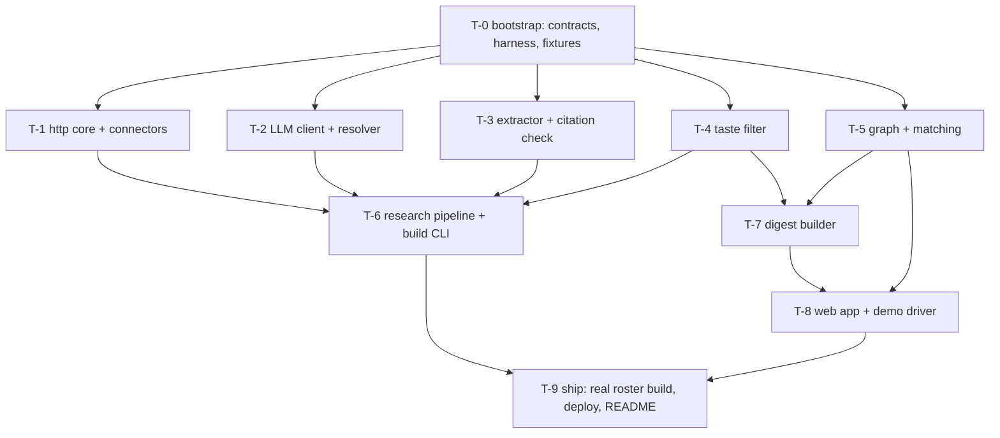

# Arrival Engine — Task Graph

Ten tickets. Hour estimates total ~16.5 against a ~14 h budget; the cut list at the bottom says what to drop. Waves are computed from `depends_on` at dispatch time — after T-0 closes, **T-1, T-2, T-3, T-4, T-5 are parallel-safe** (disjoint file scopes).

## Dependency graph

## Tickets

### T-0: Repo skeleton, contracts, test harness and fixtures exist and the harness discriminates by ticket
- **Objective**: Give every downstream ticket the shared surface it imports (contracts, util, config, doubles, fixture dossiers) and a test harness that can grade one ticket at a time, so parallel tickets never redefine a model or reinvent a slug function. ~1.5 h.
- **Refs**: C3, C7, Design §Interfaces (all), §Data models, Decisions 10 + shared primitives.
- **Acceptance**:
  1. `src/arrival/contracts.py` defines every model/Protocol in Design §Interfaces verbatim in signature (fields, types, literals) and `test_contracts_roundtrip` round-trips a `Dossier` through `model_dump_json`/`model_validate_json`.
  2. `src/arrival/util.py` ships `slug(str)->str`, `normalize_ws(str)->str` (collapse whitespace, casefold), `doc_id(url)->str` (sha1[:16]); `test_util` pins examples: `slug("Jane O'Neil-Ruiz")=="jane-oneil-ruiz"`, `normalize_ws("A  b\nC")=="a b c"`.
  3. `tests/conftest.py` registers the `ticket` marker and the `--ticket` option; `pytest --ticket T-0` runs only tests marked `ticket("T-0")` and deselects a deliberately planted `ticket("T-999")` test (assert via `pytest --ticket T-0 --collect-only -q` output in `test_harness_runs`, or via `pytester`). Execute this — Decision 10 is `[reasoned — not executed]`.
  4. `conftest.py` installs an httpx transport that raises `RuntimeError("network disabled in tests")` on any request; `test_network_disabled` proves it.
  5. `tests/doubles.py` ships `LLMDouble` (scripted by `schema.__name__` + prompt substring, records calls, satisfies `LLMClient`) and `ConnectorDouble`; `test_doubles_conform` asserts `isinstance(LLMDouble(), LLMClient)` via `runtime_checkable`.
  6. `tests/fixtures/dossiers/` contains four schema-valid synthetic dossiers (`alpha`, `bravo`, `charlie`, `delta`) designed so: all four share the generic hubs `city:austin` and `topic:ai` (so IDF clamps them to 0); alpha–bravo share nothing else; charlie–delta additionally share one rare hub (`investor:foundry-seed-2019`); alpha has ≥2 excluded facts (`family`, `home_or_property`) and ≥1 `non_obvious` fact from `wayback`; every fact's quote is a substring of a paired `tests/fixtures/http/*.json` RawDoc text. `test_fixture_dossiers_valid` loads and validates all four.
  7. `pyproject.toml` (ruff, pytest config, deps pinned per C3), `.gitignore` (`.cache/`, `.env`), `.env.example` (ANTHROPIC_API_KEY, TAVILY_API_KEY, GITHUB_TOKEN, CONTACT_EMAIL, DEBUG_VIEWS, model IDs), `src/arrival/config.py` Settings, `src/arrival/__main__.py` with `main(argv, *, connectors=None, llm=None) -> int` that prints usage and returns 2 for unknown commands (T-6 fills `build`), README skeleton, and `HOURS.md` (append-only hours log, one line per ticket: ticket, what, hours; exempt from scope collision checks — see EXECUTION §8).
- **Verify**: `pytest --ticket T-0 && ruff check src tests`
- **Scope**: `pyproject.toml, .gitignore, .env.example, README.md, HOURS.md, src/arrival/{__init__,__main__,contracts,util,config}.py, tests/conftest.py, tests/doubles.py, tests/test_t0_*.py, tests/fixtures/dossiers/**, tests/fixtures/http/fixture_dossier_docs_*.json`
- **Reads**: none
- **Provides**: Design §Interfaces (all models, Protocols) → every ticket; `util.slug/normalize_ws/doc_id` → T-1, T-2, T-3, T-5; `tests/doubles.LLMDouble` → T-2, T-3, T-4, T-6, T-7; `tests/doubles.ConnectorDouble` → T-6; fixture dossiers → T-5, T-7, T-8.
- **Conforms to**: none
- **Depends on**: none — `bootstrap: true`
- **Non-goals**: no connector, LLM, graph or route logic; no real people in fixtures.

### T-1: Every connector returns cited RawDocs from recorded fixtures, and the HTTP core is rate-limited, cached and never raises
- **Objective**: The "go wide" data layer — one `Connector` per source class, behind a shared client that caches to disk, throttles per host, and degrades to `[]` on failure, so the research pipeline can fan out without babysitting. This ticket is where "data judgment" lives. ~3 h.
- **Refs**: R1, C1, C2, C5, Design §Interfaces/RawDoc+Connector, function table rows `http/client.py` and `connectors/__init__.py`, Decisions 7, 8.
- **Acceptance**:
  1. `http/client.py`: `fetch_text(url)` returns a `RawDoc` with non-empty extracted text (HTML → text via a light extractor; JSON passthrough), writes/reads `.cache/http/{doc_id}.json`, sends `User-Agent: ArrivalEngine/0.1 (+{CONTACT_EMAIL})`, and enforces a per-host token bucket (SEC 10/s, arXiv 1/3s, USPTO 45/min, Wayback 1/s, default 2/s). `test_client_cache_hit` proves a second call does not touch the transport; `test_client_rate_limit` proves ≥ spacing using a fake clock; `test_client_never_raises` proves a 500/timeout yields `None`.
  2. Connectors implemented, each a `Connector` with `kind` set and `search(person, budget)`: `search` (Tavily, DDG-lite fallback when no key or on error), `wikidata` (SPARQL name search filtered by detail → QID + labelled affiliations as text), `wikipedia`, `github` (user search + recent public events/repos), `edgar` (full-text search by name+company; Form D/4/13F hits as text), `wayback` (CDX for the person's site/company site; fetch 1–2 old snapshots), `propublica` (org search by company/person name → 990 officer/board lines), `hn` (Algolia by author/name), `openalex` (author search), `self_page` (fetch URLs found in details or Wikidata official-website, plus `/feed` RSS if present). Each has one test against `tests/fixtures/http/{kind}_*.json` asserting ≥1 RawDoc with correct `source_kind`, `url`, non-empty `text`, and `budget` respected.
  3. Every connector returns `[]` (not raise) when its fixture is absent or the transport errors (`test_connectors_degrade`).
  4. `all_connectors(settings)` returns them in display-priority order and omits `fec`/`courtlistener` (`test_all_connectors_order`).
  5. `tests/fixtures/http/` contains a recorded, redacted response per connector for a synthetic person (the fixture text must be hand-written or from a public page about a *fictional* subject — no real people).
- **Verify**: `pytest --ticket T-1 && ruff check src/arrival/http src/arrival/connectors`
- **Scope**: `src/arrival/http/**, src/arrival/connectors/**, tests/connectors/**, tests/fixtures/http/{kind}_*.json` (excluding `fixture_dossier_docs_*` owned by T-0)
- **Reads**: `src/arrival/contracts.py`, `src/arrival/util.py`, `src/arrival/config.py` (T-0)
- **Provides**: Design function table `all_connectors`, `fetch_text` → T-6
- **Conforms to**: `contracts.Connector` (test: `isinstance(c, Connector)` for each)
- **Depends on**: T-0
- **Non-goals**: no LLM calls; no LinkedIn/X; no FEC/CourtListener/USPTO/YouTube/Podcast connectors (SPEC Q4 default — `SourceKind` keeps their names so they can be added later); no live network in tests. Do not invent a second slug/hash helper.

### T-2: The resolver accepts the target, rejects same-name decoys, and the real LLM client conforms to the double
- **Objective**: Correctness is the top priority and this is where it is decided: a Wikidata/strong-key anchored, per-document LLM verdict with hard negative-evidence vetoes, plus the production `LLMClient`. ~2 h.
- **Refs**: R2, C6, S4, Design §Interfaces/Verdict+Resolution+LLMClient, Decisions 4, 9.
- **Acceptance**:
  1. `llm/client.py` `AnthropicClient` implements `LLMClient.structured` with temperature 0, JSON-schema output, cached system prefix, one retry on invalid JSON then `LLMError`; `test_client_conforms` asserts both `AnthropicClient` and `LLMDouble` satisfy the Protocol; `test_client_parses` uses a stubbed SDK response.
  2. `resolve(person, docs, llm)` returns `resolved` only when (a) a strong key is found (QID matched on name + detail, company domain from detail, GitHub profile with matching name+company, SEC CIK on name+company) OR (b) ≥2 `yes` verdicts citing different disambiguators; otherwise `unresolved` with empty `accepted_doc_ids`.
  3. Any verdict `no` whose evidence asserts a conflicting employer/city hard-rejects that doc even if name matches (`test_negative_evidence_vetoes`).
  4. Ground truth: `tests/fixtures/resolve_cases/` holds ≥3 synthetic cases, one of which mirrors the real decoy pattern in SPEC Q1 (two people with the same name, different profession, one deceased) using fictional text, (target + decoy docs + scripted verdicts + expected outcome), reviewed by the owner; `test_resolver_cases` passes all, including one case that must come out `unresolved`.
  5. Every `Verdict.evidence` is checked as a substring of the doc text (via `util.normalize_ws`); verdicts failing this are downgraded to `unsure`.
- **Verify**: `pytest --ticket T-2 && ruff check src/arrival/llm src/arrival/resolve.py`
- **Scope**: `src/arrival/llm/**, src/arrival/resolve.py, tests/llm/**, tests/resolve/**, tests/fixtures/resolve_cases/**`
- **Reads**: `src/arrival/contracts.py`, `src/arrival/util.py`, `src/arrival/config.py`, `tests/doubles.py` (T-0)
- **Provides**: `llm.AnthropicClient` → T-6, T-7, T-8; `resolve.resolve` → T-6
- **Conforms to**: `contracts.LLMClient`; `tests/doubles.LLMDouble` behaviour (same call signature and error type)
- **Depends on**: T-0
- **Non-goals**: no fact extraction; no network in tests; do not loosen the strong-key rule to raise coverage.
- **Notes**: confirm current model IDs from Anthropic docs before setting `config.py` defaults; they are settings, not constants (Design Decision 9).

### T-3: The extractor emits schema-valid facts and hubs, and drops any fact whose quote is not in its source
- **Objective**: Turn accepted documents into ≤200-char cited facts and canonical hubs, with a mechanical citation check as the hallucination guard, so everything downstream can trust `Fact.provenance`. ~2 h.
- **Refs**: R9, C6, C8, S6, Design §Interfaces/Fact+Hub+Provenance, §Data models non-obvious eligibility, Decision 5.
- **Acceptance**:
  1. `extract(person, resolution, docs, llm)` calls `llm.structured` per accepted doc (or per batch ≤ 3 docs) with an internal `ExtractionResult` schema and returns `(facts, hubs)` conforming to contracts; `test_extract_shapes` with `LLMDouble`.
  2. Citation check: a fact whose `provenance.quote` is not a `normalize_ws` substring of its doc's text is dropped and counted; `test_citation_drop` feeds one good and one fabricated quote and asserts only the good fact survives.
  3. Hubs are canonical: `hub_id = "wd:Q…"` when the hub came from a `wikidata` doc that carries the QID, else `f"{type}:{slug(label)}"`; the same label across two docs yields one Hub with merged `evidence_fact_ids`; stop-hubs from Decision 3 are never emitted (`test_hub_canonical`, `test_stop_hubs`).
  4. `recency` is set from `published_at`: 1.0 within 12 months, 0.6 within 3 years, 0.3 otherwise, 0.5 when unknown (`test_recency`).
  5. Facts from non-obvious-eligible source kinds are labelled `category="non_obvious"` when the LLM flags them as not-bio-page material, else their natural category (`test_non_obvious_label`).
- **Verify**: `pytest --ticket T-3 && ruff check src/arrival/extract.py`
- **Scope**: `src/arrival/extract.py, tests/extract/**`
- **Reads**: `src/arrival/contracts.py`, `src/arrival/util.py`, `tests/doubles.py` (T-0)
- **Provides**: `extract.extract` → T-6
- **Conforms to**: none
- **Depends on**: T-0
- **Non-goals**: no taste decisions (T-4 owns exclusion); no resolution logic; no real LLM in tests.

### T-4: The taste filter excludes every must-exclude case and keeps every must-keep case in the owner-approved fixture
- **Objective**: Encode the "seen vs dossiered" line as code that fails closed — rules first, LLM only on `unsure`, anything still unsure excluded — graded against a human-approved fixture, not its own table. This is the scored differentiator. ~1.5 h.
- **Refs**: R11, R12, R13, R14, S3, Design function table `taste.py`, Decision 6.
- **Acceptance**:
  1. `tests/fixtures/taste_cases.yaml` exists with ≥30 cases spanning all six R11 categories plus ≥10 must-keep professional facts (including tricky keeps: "raised a Series B", "board of a children's hospital foundation", "keynoted at SXSW"); **the owner has reviewed and approved it** (record `# approved_by: <name> <date>` as the first line of the YAML).
  2. `apply_taste_rules(facts)` marks clear cases deterministically; `apply_taste(facts, llm)` sends only unsure ones to the LLM and excludes anything still unsure; `test_taste_cases` runs every fixture case with `LLMDouble` scripted for the unsure ones and asserts 100% agreement with `expect`.
  3. `is_displayable(fact)` returns False for excluded facts, `confidence < 0.7`, or `source_kind ∉ DISPLAYABLE_KINDS` (`test_is_displayable`).
  4. `EXCLUSION_POLICY` is a single paragraph naming all six categories (`test_policy_text` asserts each category word appears).
  5. Fail-closed proven: `test_fail_closed` scripts the double to return `unsure` and asserts the fact is excluded with reason `low_confidence`.
- **Verify**: `pytest --ticket T-4 && ruff check src/arrival/taste.py`
- **Scope**: `src/arrival/taste.py, tests/taste/**, tests/fixtures/taste_cases.yaml`
- **Reads**: `src/arrival/contracts.py`, `tests/doubles.py` (T-0)
- **Provides**: `taste.apply_taste`, `is_displayable`, `DISPLAYABLE_KINDS`, `EXCLUSION_POLICY` → T-6, T-7, T-8
- **Conforms to**: none
- **Depends on**: T-0
- **Non-goals**: no rewriting of fact text; no sentiment/personality inference; do not weaken a category to make a keep case pass — change the fixture with owner approval instead.

### T-5: Matching ranks rare shared hubs above generic ones and exposes the score components and path
- **Objective**: The user's interest-graph idea, made concrete: people as leaves, hubs as centres, IDF-weighted shared hubs produce a 0–100 score with visible components and a graph path as the "why". ~1.5 h.
- **Refs**: R10, S5, R17 (optional), Design §Interfaces/Match+HubContribution, Decision 3 (executed artifact).
- **Acceptance**:
  1. `build_graph(dossiers)` returns a bipartite `nx.Graph` with nodes `person:{id}` and `hub:{hub_id}`, per-edge `recency` (that person's `Hub.recency`), per-hub-node `idf` and `type_boost`, edge `cost=1/(1+idf)`; a pair's contribution uses `min` of the two edge recencies; excluded facts' hubs are still included (matching is not display) (`test_graph_shape`).
  2. IDF per Decision 3 with clamp at 0; using the four T-0 fixture dossiers, `match(g, "charlie", ["alpha","bravo","delta"])` ranks `delta` first and its top contribution hub is the rare investor hub; `match(g, "alpha", ["bravo"])` yields score 0 with contributions all zero (`test_rare_beats_generic`).
  3. `Match.contributions` is sorted desc and `sum(c.contribution) == raw` before normalisation; `Match.path` is the weighted shortest path via `cost` and passes through the top hub (`test_components_and_path`).
  4. `Match.why` is a deterministic template naming up to two top hubs by label (no LLM): e.g. "Both backed by Foundry (2019 seed); both writing about developer-tools GTM." (`test_why_template`).
  5. Normalisation per Decision 3 against `REF = ln(N/3)*1.5`: with the four fixtures, charlie–delta (one rare investor hub, recency 1.0) scores 100 and alpha–bravo scores 0; score ∈ [0,100]; the arriving person is never in the output; every present person is (`test_normalisation`).
- **Verify**: `pytest --ticket T-5 && ruff check src/arrival/graph.py`
- **Scope**: `src/arrival/graph.py, tests/graph/**`
- **Reads**: `src/arrival/contracts.py`, `tests/fixtures/dossiers/**` (T-0)
- **Provides**: `graph.build_graph`, `graph.match` → T-7, T-8
- **Conforms to**: none
- **Depends on**: T-0
- **Non-goals**: no LLM; no embeddings fallback (cut list item, add only if S5 fails on real data); no rendering.

### T-6: `python -m arrival build` produces validated dossiers and a report from a roster, fully offline against doubles
- **Objective**: Compose connectors → resolver → extractor → taste into `build_dossier`, with budgets, per-source zero-result reporting, and a CLI that writes `data/dossiers/*.json` — the thing you run once on the ten people. ~1.5 h.
- **Refs**: R1, R2, S1, C6, Design function table `research.py`, `Budget`, `BuildReport`, Decisions 2, 8.
- **Acceptance**:
  1. `build_dossier(person, connectors, llm, budget)` fans out over connectors concurrently (bounded by `budget.docs_per_connector`, total `max_docs_total`), resolves, extracts only accepted docs, applies taste, assembles a `Dossier`; `test_build_dossier_happy` with `ConnectorDouble`s + `LLMDouble` yields a dossier with ≥1 kept fact, ≥1 excluded fact, ≥1 hub.
  2. When resolution is `unresolved`, the dossier has `facts == []`, `hubs == []`, `status == "unresolved"` and no extraction LLM call is made (`test_unresolved_no_extract` asserts on `LLMDouble.calls`).
  3. `build_all(roster_path, out_dir)` writes one JSON per person to `out_dir`, writes every accepted `RawDoc` to `out_dir/../docs/{doc_id}.json` (so citations are reproducible offline — T-9 depends on this), skips people whose dossier exists unless `--force`, and returns a `BuildReport` listing `zero_result_sources` per person; `test_build_all_writes_and_reports` uses a two-person synthetic roster in `tests/fixtures/roster_synthetic.yaml` and a tmp dir.
  4. `budget.max_llm_calls` is enforced: the double counts calls and the pipeline stops extracting (keeps what it has) at the cap (`test_llm_budget`).
  5. CLI: `python -m arrival build --roster … --out … [--force] [--only person_id]` prints the report table; `test_cli_build` calls `arrival.__main__.main([...], connectors=[ConnectorDouble…], llm=LLMDouble(...))` in-process with the synthetic roster and a tmp out dir and asserts the files exist and the return code is 0. No subprocess, no network.
- **Verify**: `pytest --ticket T-6 && ruff check src/arrival/research.py src/arrival/__main__.py`
- **Scope**: `src/arrival/research.py, src/arrival/__main__.py (fills the `build` subcommand; keeps the T-0 `main(argv, *, connectors, llm)` signature), tests/research/**, tests/fixtures/roster_synthetic.yaml`
- **Reads**: `contracts.py`, `config.py`, `tests/doubles.py` (T-0); `connectors.all_connectors` (T-1); `resolve.resolve`, `llm.AnthropicClient` (T-2); `extract.extract` (T-3); `taste.apply_taste` (T-4)
- **Provides**: `research.build_all` → T-9
- **Conforms to**: none
- **Depends on**: T-1, T-2, T-3, T-4
- **Non-goals**: no fast-refresh-on-arrival (Q3: add only if all of T-0..T-9 are green with time left); no Batch API (use it manually at T-9 if desired); no real roster.

### T-7: The digest builder enforces every cap, cites every fact, and always yields a say-out-loud line within 2.5 s
- **Objective**: Assemble a `Digest` that a host can read in ninety seconds: hard caps, displayable-only facts, exactly one non-obvious fact, one invitation-style opener with timeout fallback, and a numbered source list covering every shown fact. ~1 h.
- **Refs**: R7, R8, R9, R13, R14, R18, S6, Design §Interfaces/Digest, function table `digest.py`, Decision 12.
- **Acceptance**:
  1. `make_digest(dossier, matches, llm)` returns `len(meet) ≤ 3`, `len(lately) ≤ 3`, `lately` sorted by `published_at` desc and containing only `is_displayable` facts, `non_obvious` chosen per Design §Data models eligibility (or `None`), `who_line` built from `current_work` facts (`test_caps_and_selection` on fixture dossier `alpha`, which has excluded facts that must not appear).
  2. `sources` contains every `Provenance` referenced by the facts behind `who_line`, `lately`, `non_obvious`, and — for each Meet row — the arriving person's facts named in `contributions[*].hub.evidence_fact_ids` (Design: contribution hubs are the arriving person's), deduped by `doc_id`, in first-use order (`test_sources_cover_all`).
  3. `say_out_loud` is produced by one `llm.structured` call whose output is validated to start with one of `Ask`, `Ask about`, `Curious` and to contain no first-person surveillance phrasing (`I saw`, `we noticed`, `our records`); on timeout (>2.5 s, simulated with a slow double) or validation failure it falls back to `f"Ask about {hook.text}"` where `hook` is the highest-confidence displayable `hook` fact (or the most recent displayable fact if none) (`test_say_out_loud_fallback`, `test_say_out_loud_shape`).
  4. `exclusion_policy == taste.EXCLUSION_POLICY` and `meet == []` is represented (not padded) when no one else is present (`test_empty_building`).
  5. Speakability (R18): `who_line`, each `meet[*].why`, and `say_out_loud` contain no `http`, no `[n]` markers, no parentheses, no digits used as a score, and are ≤ 30 words each (`test_speakable`).
- **Verify**: `pytest --ticket T-7 && ruff check src/arrival/digest.py`
- **Scope**: `src/arrival/digest.py, tests/digest/**`
- **Reads**: `contracts.py`, `tests/doubles.py`, `tests/fixtures/dossiers/**` (T-0); `taste.is_displayable`, `taste.EXCLUSION_POLICY` (T-4); `graph.build_graph`, `graph.match` (T-5)
- **Provides**: `digest.make_digest` → T-8
- **Conforms to**: none
- **Depends on**: T-4, T-5
- **Non-goals**: no HTML; no matching logic; no LLM rewriting of facts (facts are shown verbatim as extracted).

### T-8: The web app boots from dossiers, tracks presence, and renders digest, building, debug and demo-driver pages
- **Objective**: The live URL: FastAPI routes per Design, in-memory presence, server-rendered HTML for the digest (all R7 sections, reasoning toggle, policy paragraph), `/debug` gated by env, and a `/` page with arrive/leave buttons so the demo is one click. ~1.5 h.
- **Refs**: R3–R8, R10, R13, R15, S2, C4, Design §Interfaces routes, Decision 11.
- **Acceptance** (all via `fastapi.testclient` with the app pointed at `tests/fixtures/dossiers/` and `LLMDouble`):
  1. Boot loads and validates every dossier JSON; a corrupt file aborts startup with its path in the error (`test_boot_validates`).
  2. `POST /arrive` for `charlie` with `alpha`,`bravo`,`delta` present returns 200 with `digest_id` in <3 s wall-clock, adds charlie to presence; unknown name → 404 and no LLM call (`test_arrive`).
  3. `GET /digest/{id}` HTML contains the six R7 section headings in order, ≤3 Meet rows each showing a score and a why, a `data-reasoning` block per Meet row listing hub label + weight + recency + type boost, the numbered sources with hrefs, and the exclusion policy paragraph; excluded fixture facts (family/address text) do not appear anywhere in the HTML (`test_digest_render`, `test_taste_not_in_html`).
  4. `POST /leave` removes a person and the next digest no longer proposes them; `GET /building` lists present people (`test_presence`).
  5. `GET /debug/charlie` → 404 when `DEBUG_VIEWS` unset, 200 with excluded facts + reasons + rejected verdicts when set (`test_debug_gate`).
  6. `GET /` lists roster with working arrive/leave forms (plain HTML forms posting to the routes) (`test_index_driver`).
- **Verify**: `pytest --ticket T-8 && ruff check src/arrival/web`
- **Scope**: `src/arrival/web/**, tests/web/**`
- **Reads**: `contracts.py`, `config.py`, `tests/doubles.py`, `tests/fixtures/dossiers/**` (T-0); `taste.EXCLUSION_POLICY` (T-4); `graph.*` (T-5); `digest.make_digest` (T-7)
- **Provides**: routes → T-9 (manual)
- **Conforms to**: none
- **Depends on**: T-5, T-7
- **Non-goals**: no auth, no JS framework, no CSS beyond a few inline rules, no `/graph` unless T-0..T-9 are all green (R17 optional).

### T-9: Real roster built, app deployed at a public URL, README complete with hours log and next-month paragraph
- **Objective**: Turn the working system into the submission: run the build on the ten real people (supplied separately), review each dossier by hand for correctness and taste, commit, deploy to Render (fallback Cloudflare Tunnel), rehearse the demo once, and finish the README. ~1 h plus build wall-clock.
- **Refs**: R16, S7, S8, C4, SPEC "Optional" and Open questions.
- **Acceptance** (human-gated; recorded as a README checklist, plus one attributed test):
  1. `data/roster.yaml` filled with the ten people; `python -m arrival build` run; every dossier hand-reviewed: each shown fact opened at its URL and confirmed; any wrong or distasteful fact triggers a fix in the pipeline or a fixture addition to `taste_cases.yaml`, never a hand-edit of the JSON. `test_committed_dossiers_valid` (marked `ticket("T-9")`) asserts ≥ 10 files in `data/dossiers/`, validates each, and asserts every displayable fact's quote is present (via `util.normalize_ws`) in the RawDoc committed at `data/docs/{doc_id}.json`.
  2. `render.yaml` + start command deploy the app; the URL serves `/building` and a full digest; warm-up note in README.
  3. README: the hours log folded in from `HOURS.md` (totalled), deploy URL, how to run, the exclusion policy, the "what I'd build next with a month and real data" paragraph, and the answers to the assumed open questions Q1–Q5.
  4. One full demo rehearsal following the 10-minute flow (arrive → digest → reasoning toggle → non-obvious fact → `/debug` showing withheld facts) with times noted in the README.
- **Verify**: `pytest --ticket T-9`
- **Scope**: `data/roster.yaml, data/dossiers/**, data/docs/**, render.yaml, README.md, HOURS.md, tests/test_t9_committed_dossiers.py`
- **Reads**: `research.build_all` (T-6); `web/**` (T-8); `contracts.py`, `util.py` (T-0)
- **Provides**: none
- **Conforms to**: none
- **Depends on**: T-6, T-8
- **Non-goals**: no new features; no hand-editing dossier JSON; no polish.

## Cut list (drop in this order if behind schedule)

1. T-6 fast refresh (already excluded by default) and T-8 `/graph` (R17).
2. T-1: drop `openalex` and `hn`; keep `search`, `wikidata`, `wikipedia`, `github`, `edgar`, `wayback`, `propublica`, `self_page`.
3. T-7: drop the LLM say-out-loud call; use the template fallback only.
4. T-8: drop the `/` demo driver; drive the demo with `curl`.
5. T-2: replace `AnthropicClient` structured-output niceties (caching) with a plain JSON-mode call — never drop the strong-key rule or negative-evidence veto.
6. **Never cut**: citation check (T-3), taste filter + approved fixture (T-4), score components + path (T-5), digest caps (T-7).
